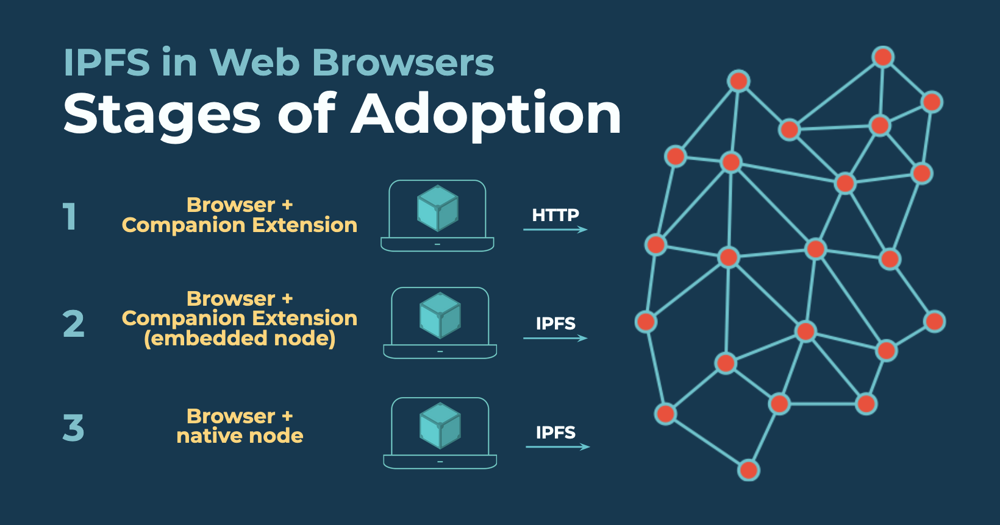
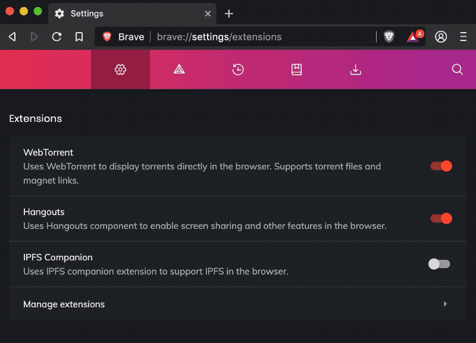
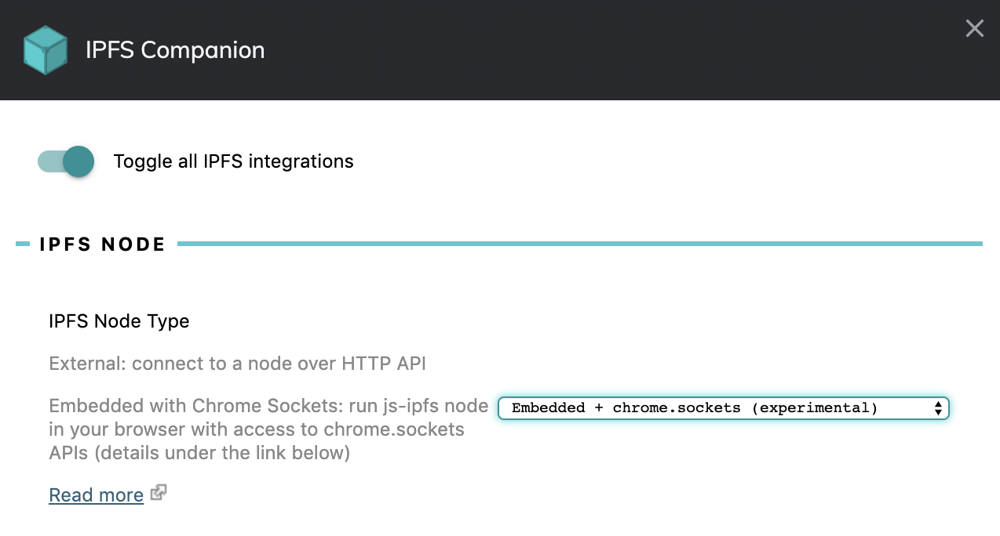

Decentralization can feel slow in providing user-centric approaches to the internet's biggest problems. Right now, software that is fully in the control of the user is often too technical, too fragile, and too time-consuming to be the default choice.

But we're making headway. Today, we'd like to share some collaborations the IPFS project has had in the works for a while, which bring us a few steps closer to making unmediated access to information _just work_... by solving that "last mile" problem and _integrating IPFS directly into web browsers_.

## Stages

The path to a truly decentralized web is a long one. For over 30 years the browser has been a [_client_](<https://en.wikipedia.org/wiki/Client_(computing)>) – but a foundational concept in P2P systems is that a participant is both a client _and a [server](<https://en.wikipedia.org/wiki/Server_(computing)>)\_. Web browser vendors and web standards bodies have not designed for this architectural shift, so we're breaking it down into steps.

From the beginning, IPFS had an HTTP gateway. The gateway lets HTTP clients like web browsers publish to and read from the IPFS network. Now there are [lots of different public HTTP gateways to the IPFS network](https://ipfs.github.io/public-gateway-checker/), and the gateway we run at ipfs.io serves over _five million_ requests per day.

Initially in our browser work, we're aiming to ease access to the IPFS HTTP gateways - creating a bridge between the billions of people on the centralized web and content on the distributed web. We expect some experimentation in the next phase - adjusting node behavior based on browser APIs, device capabilities, bandwidth availability and power consumption - while we grow adoption with our browser partners as we learn and build common understanding at standards bodies. Ultimately, we aim to have multiple browsers implement fully native (and interoperable!) IPFS support.

As part of this progression to native IPFS support, we've had ongoing collaborations with Firefox, Brave, Opera, and other browsers. Read on to hear the latest status and learn about our progress so far.

## Brave

Brave has tended to live up to its name since the beginning - riling up the browser, publisher and crypto worlds. [Since 2018](https://github.com/brave/brave-browser/issues/819) we've been working with Brave on IPFS support in some form, and the results of that work are now emerging.

Today you can open [`brave://settings/extensions`](brave://settings/extensions) in Brave and see a toggle for enabling IPFS Companion.

Removing this install step _really matters_ for adoption. While technical users are familiar with browser extensions, it's less comfortable for non-technical users, and Brave users have the additional overhead of going to the _Chrome_ web app store to find and install them.

In the future, when you [load a URL beginning with "ipfs://"](https://github.com/brave/brave-browser/issues/3045), Brave will prompt you to enable the extension, providing a smooth discovery and onboarding experience. And when you are browsing IPFS resource, the [address bar will reflect that](https://github.com/brave/brave-browser/issues/5218).

But that isn't all. One of the biggest barriers to even just experimenting with true p2p networks in browsers is the lack of APIs available to extensions and web pages. The primitives of most p2p systems are filesystem access, raw TCP sockets, UDP sockets for broadcast and receive, and in browsers you need a way to navigate using a custom protocol. We've figured out one piece of that puzzle while working with Brave: Chromium OS sockets!

[Chromium OS](https://en.wikipedia.org/wiki/Chromium_OS) has a raw sockets API, but it's disabled in the Chrome browser. Brave has modified their build to whitelist those APIs for IPFS Companion to use - and this gives us _superpowers_ compared to any other browser at this point.

These powerful APIs enable the js-ipfs node embedded in the browser to provide a _true_ P2P experience without the need for an external daemon:

- The embedded HTTP Gateway removes reliance on public gateways, by connecting over HTTP to a local IPFS node
- TCP transport improves connectivity - not only by enabling transport interoperability with go-ipfs nodes, but also makes direct browser-to-browser communication within the same network possible
- UDP sockets enable DNS-based service discovery of go-ipfs in LAN, and we are working on additional browser-to-browser discovery methods that work in offline environments

By default, our browser extension still expects [IPFS Desktop](https://github.com/ipfs-shipyard/ipfs-desktop#ipfs-desktop) to be installed, however you can select the experimental option shown below in order to run _a standalone IPFS node_ in Brave itself. Mind this is an _early preview_ of both a full JS IPFS node and a gateway running in a browser extension. Performance and features will improve over time.

At IPFS Camp earlier this year, Brave engineer Jocelyn Liu demoed some of these features at the science fair, including one-click install of Companion, the embedded gateway, and also talks about what's to come: tackling the current connectivity limitations such as the lack of DHT support in js-ipfs, and also plans Brave has for the design of the address bar when loading IPFS content.

<iframe width="2000" height="600" src="https://www.youtube-nocookie.com/embed/oMqe9LfnIDU" frameborder="0" allow="accelerometer; autoplay; encrypted-media; gyroscope; picture-in-picture" allowfullscreen></iframe>

## Opera

Opera is another [early leader](https://blogs.opera.com/mobile/2018/12/ofa-49-with-crypto/) in the space. They've developed _native_ crypto wallets in their browsers, which began shipping in 2018 in Android and are now released in their iOS and desktop browsers as well.

Earlier this year [Opera announced they were working on support for IPFS](https://twitter.com/ensdomains/status/1102884419017297921)! We've been talking ever since, and are looking forward to the launch of IPFS support in their Android browser by the end of this year.

## Firefox

We've been working with Mozilla on initial APIs since 2018, when the [libdweb project](https://github.com/mozilla/libdweb) emerged, providing browser extension APIs for many of the primitives a P2P system needs: filesystem access, TCP, UDP and protocol registration and handling. Earlier in 2018 the [ipfs:// scheme was whitelisted in Firefox](https://blog.mozilla.org/addons/2018/01/26/extensions-firefox-59/), so now with libdweb we were able to experiment with a proper [ipfs:// protocol handler](https://github.com/ipfs-shipyard/ipfs-companion/pull/533), which we demoed at Lab Day in August 2018:

<iframe width="2000" height="600" src="https://www.youtube-nocookie.com/embed/fS8pLOQdOoM" frameborder="0" allow="accelerometer; autoplay; encrypted-media; gyroscope; picture-in-picture" allowfullscreen></iframe>

We used yet more APIs in libdweb to implement [local discovery and TCP transport](https://github.com/ipfs-shipyard/ipfs-companion/pull/553):

<iframe width="2000" height="600" src="https://www.youtube-nocookie.com/embed/FRzyWUXIyeo" frameborder="0" allow="accelerometer; autoplay; encrypted-media; gyroscope; picture-in-picture" allowfullscreen></iframe>

Unfortunately, libdweb is still an experimental set of APIs - not included in Firefox yet. We're hoping to see more progress soon from Mozilla on shipping libdweb APIs in Firefox for at least some extensions this year!

## The Work is Just Beginning

Integrated IPFS gateway support is one big step forward, but as the name implies, it isn't truly decentralized. Only when a browser can be a full participant in the network - both a client _and_ a server - will we have a truly distributed web.

These early-adopters light the way, proving out what works and doesn't, and easing development for dapp developers in the near term.

But there's a lot of work to be done. IPFS itself is still in flux, with major work ongoing in performance and robustness, and new features around privacy and content filtering.

We're working on detailed use-cases to share with standards bodies, and a threat model that browser vendors can build and design against. Both are prerequisites for a future where all major browsers have interoperable implementations, which is what would make IPFS truly be part of the web.

Web browsers have been solely a client for over 30 years - putting all power in the hands of the server. This year marks a paradigmatic shift in the belief of what a browser can be. Change is now happening at the level from which that power is derived: the network.

## This is a Preview!

Consider this a sneak peek. There's more on the way:

- In Brave, the gateway is, well... a gateway to even more: We're working on local discovery (mDNS) of IPFS nodes, and also Brave-to-Brave connectivity for embedded nodes.
- We're continuing our experiments with [libdweb](https://github.com/mozilla/libdweb) in Firefox, both on desktop and Android.
- [Puma Browser](https://www.pumabrowser.com/), the first mobile browser with support for [Coil's micropayments for publishers](https://www.grantfortheweb.org/), is interested in IPFS support.
- Keeping a close eye on [Bundled HTTP Exchanges](https://wicg.github.io/webpackage/draft-yasskin-wpack-bundled-exchanges.html) and ways IPFS could provide decentralized alternative to centralized HTTP CDNs.
- We're exploring what a native Chromium implementation might look like...

If you're an experienced Chromium developer or mobile app developer and you're interested in working on some of these projects, contact Dietrich Ayala on [Twitter](https://twitter.com/dietrich), the [fediverse](https://mastodon.social/@dietrich), [Secure Scuttlebutt](@vB/yLGZ7vBGgPMTG5NEczZc6ufr0YqhxRScOk6jPi60=.ed25519) or [LinkedIn](https://www.linkedin.com/in/dietrich).
