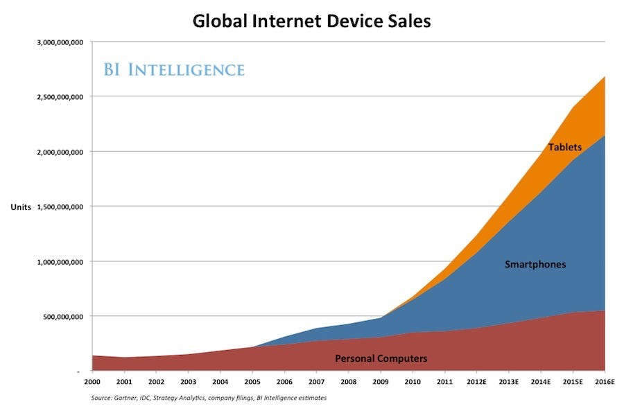

The focus of development of IPFS to date has been primarily on desktop and server-class hardware. However, the growth of the internet for more than a decade has been almost entirely on mobile devices.

This growth at the furthest edge of the network requires solutions at the edge. While the IPFS network continues to grow on mobile (for instance, IPFS now has default support on Opera for Android), more research is needed for the value of the network to be fully realized. IPFS should be directly available and accessible to end users in all their devices - and the design of IPFS integrations should make this clear and easy to use. To create that level of clarity, developers need good guidelines that align with user needs while unlocking all the power of the mobile dweb.

In emerging markets and for under-served audiences and marginalized or oppressed peoples the need for data sovereignty, offline-first applications and trustable computing is especially dire, so IPFS should function optimally on the devices used by them in order to serve their use-cases.

## Research + Design

Instead of jumping directly into [mobile implementation](https://github.com/ipfs/roadmap/issues/45), we created the **IPFS Mobile Design Guidelines project**: an initiative to research existing P2P protocol use in mobile apps, and create an informed and research-backed set of design guidelines and best-practices for IPFS and the broader P2P and dweb communities to support growth and ease-of-use on mobile.

The IPFS Mobile Design Guidelines work began in early March 2020 with a research phase investigating usage of mobile internet, cloud services, and P2P / IPFS tools - along with research on wider mobile data sharing and receiving workflows. The guidelines research is the beginning of an open body of design research intended to serve the community and inform efforts to use IPFS in mobile applications, and to use mobile devices to build resilient networks that serve the people holding them.

## Methodology

The overall project has two programmes of work. The first is primary research and synthesis, and the second is the development and publication of tools for designers, implementors and builders. The primary research phase is now in progress. It consists of qualitative interviews with three cohorts, landscape surveys of technology and interaction methods, and secondary research to produce findings to be used in the next phase. This second phase will include design recommendations for the implementation and use of IPFS on mobile, including the enumeration of use cases, the design of interaction patterns, and creation of interface components - all of which will be published for the community to use.

## Interviews

Research interviews have been split between three cohorts, the first of which are Experts. Experts are people who’ve worked on IPFS or similar technologies to gather insights and experience in developing P2P technologies for mobile users.

Simultaneously, Early Adopters were interviewed to understand in which directions the adoption of IPFS on mobile might or should go. Most Early Adopters gathered experience by working in related fields such as blockchain, decentralisation, research, data privacy and security. Therefore, they were uniquely positioned to give educated opinions and foresight in how to translate the knowledge and developments of experts into what might work for users.

Finally, we’ve begun talking to Potential Users, who are mobile phone users recruited for having had smart phone, P2P and cloud services experience across varying geographies and demographics. These future users will help guide the design phase of the Mobile Design Guidelines - which will identify features, patterns and standards to enable P2P and IPFS to gain widespread acceptance and adoption on mobile.

## Survey Review

The survey reviews will cover current uses and applications of IPFS and P2P in mobile devices. The survey is focused on mobile devices exclusively, and applications which use P2P transports in both native or web apps. It will list use-cases, and identify commonalities and differences in implementations.

## What's Next

As we wrap up the research phase of the Mobile Design Guidelines, we'll share the insights from this phase and kick off work on the next. We're looking forward to engaging the community to build a better, safer internet that works on the devices you're probably reading this on.

Learn more in the [project repository](https://github.com/ipfs/mobile-design-guidelines) and join the [Telegram channel](https://t.me/joinchat/H8bKHhSATdsqbPJsPIzcfw).

This work was funded through the IPFS DevGrants program, which sponsors work that contributes materially to the success of IPFS. Learn more [here](https://github.com/ipfs/devgrants).
