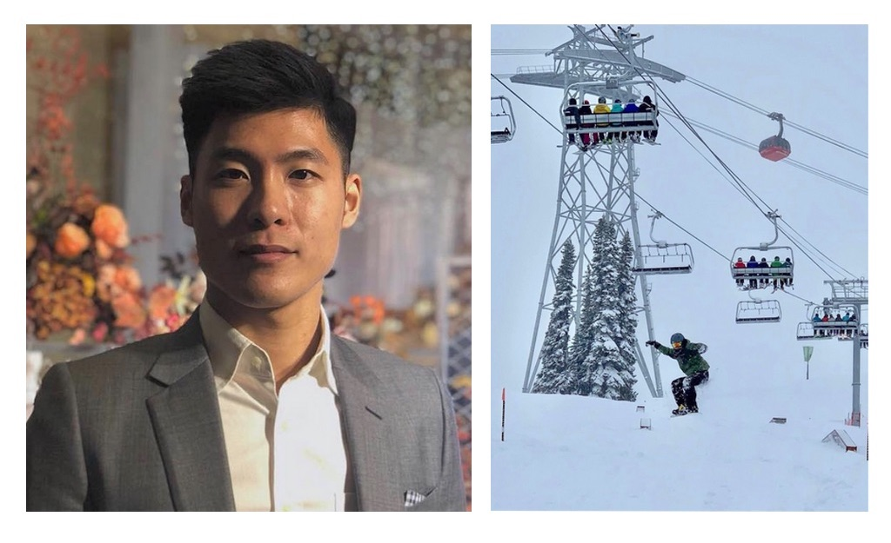

> With the first-ever IPFS Camp right around the corner, we’re interviewing some of the community members who are making this highly anticipated event a reality.
> Haven’t applied yet? Don’t worry! Registration for the 3-day hacker retreat designed for the builders of the Distributed Web is still open! Visit [camp.ipfs.io](https://camp.ipfs.io/) to learn more about IPFS Camp, scholarships, and what’s included in your conference pass.

> 💌 This interview first appeared in the [IPFS Events newsletter](http://eepurl.com/giMQzj), subscribe to receive exclusive content and invites to upcoming events.

# Meet the Community: Edgar Lee, Software Developer @ Netflix

### Tell us a bit about yourself and your background. How did you get involved with IPFS?

I work on developer tooling and infrastructure at Netflix and previously worked at Docker on the registry. The Docker Registry stores images as a merkle DAG much like IPFS, but was only granular at the layer level as opposed to file chunks. When I came across Akihiro Suda’s Filegrain proposal to use IPFS as a storage mechanism for container images, I discovered its ecosystem and started experimenting with the technology.

### Why should people be excited about IPFS?

IPFS is exciting because it builds an ecosystem of tools over the concept of content addressable storage. By decoupling what the name of some content represents, and how to get said content, we get powerful properties typically desired in distributed systems.

### What projects are really exciting you in the IPFS Ecosystem at the moment and why?

System package managers, library dependency management, container image registries all have similar requirements. Over time, some of them have individually reinvented content addressable storage and structured their data as a merkle DAG. IPFS’s 2019 roadmap to address package management is the most exciting to me right now, as it presents an opportunity to greatly improve the software landscape for both the decentralization movement, as well as private infrastructure.

### Open Source communities are full of unsung heroes. Is there someone in IPFS community who you admire for their work?

Recently, magik6k and others worked hard on refactoring the IPFS Core API and created a clean HTTP client for IPFS. I use the results of this work extensively for the experiments I’m running so I’m grateful for their work. There’s also a lot of other exciting work like hsanjuan’s IPFS driver for Docker Registry, Stebalien’s work on IPFS itself, among many others.

### What are you most looking forward to at IPFS Camp?

I’m most looking forward to meeting the team behind IPFS, and mind sharing with the community. It’ll also be my first time in Barcelona, so I’m excited to visit the beautiful city.

---

Thank you for answering our questions, Edgar, looking forward to meet you at [IPFS Camp](https://camp.ipfs.io)

> 💌 This interview first appeared in the [IPFS Events newsletter](http://eepurl.com/giMQzj), subscribe to receive exclusive content and invites to upcoming events.
